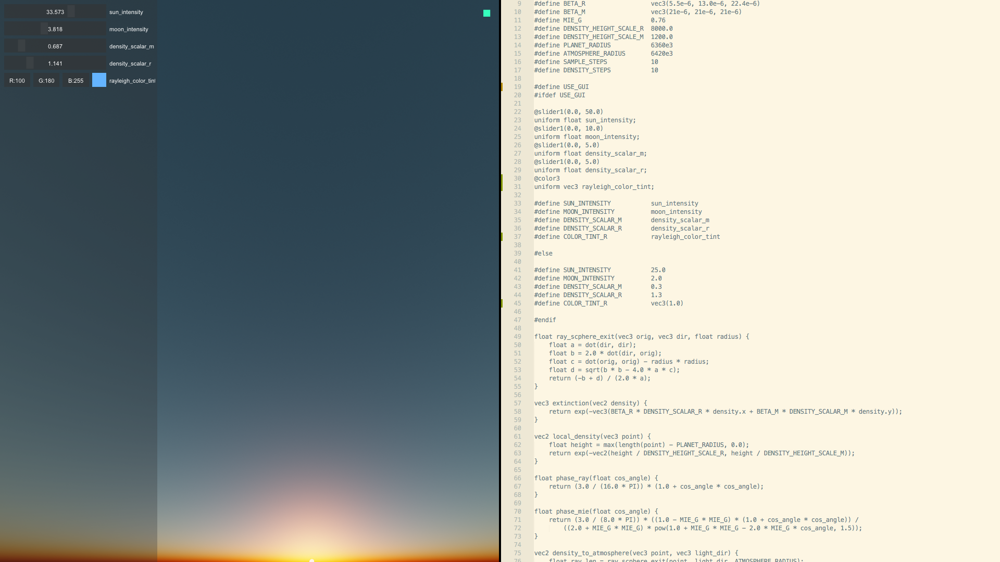

live-glsl
---------

A dynamic and lightweight shader coding tool. It dynamically reloads your shader, does on-screen error reporting and allows for GUI elements to be added from a shader syntax; allowing for uniform value tweaks.



build and run
-------------
```
> cmake . -Bbuild
> cmake --build build
```

```bash
> ./live-glsl.out --input fragment_shader_to_watch
```

example
-------

To run the example, simply run `./build/live-glsl.out examples/atmosphere.frag` from the main directory after building from sources.

builtin uniforms
----------------
 + time : float
 + resolution : vec2

GUI elements
------------


GUI elements allows to control shader uniform inputs. They use a specific syntax and should be placed right before the uniform statement they are associated with.

The following GUI elements are supported:

- `slider1`
- `slider2`
- `slider3`
- `slider4`
- `drag1`
- `drag2`
- `drag3`
- `drag4`
- `color3`
- `color4`

GUI elements should be preceded by an `@` and immediately followed by their parameters in parenthesis.

Drag types follow the syntax `drag(speed, min_value, max_value)`. For example:
```
@drag2(0.1, 0.0, 1.0)
uniform vec2 uniform_name;
```

Slider types follow the syntax `slider(min_value, max_value)`. For example:
```
@slider1(-1.0, 1.0)
uniform float uniform_name;
```

Color types do not need any parameter.
